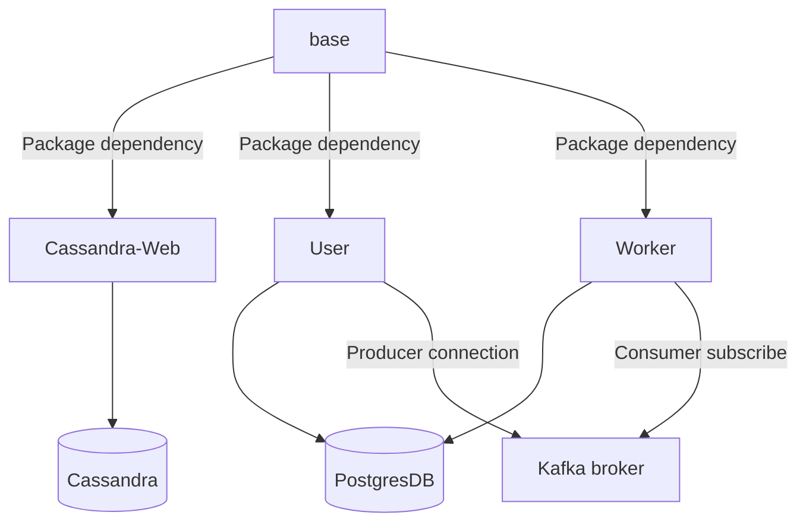
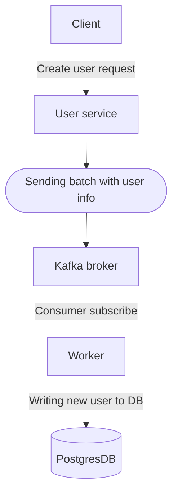

# Glassbox nodejs starter


# Table of Contents

- [Glassbox nodejs starter](#glassbox-nodejs-starter)
- [Table of Contents](#table-of-contents)
  - [Introduction](#introduction)
  - [Techstack](#techstack)
  - [Usage](#usage)
  - [Install](#install)
    - [Running project](#running-project)
    - [First login](#first-login)
  - [Project Structure](#project-structure)
    - [`user package` structure](#user-package-structure)
  - [Containers dependencies](#containers-dependencies)
  - [Create user flow](#create-user-flow)

## Introduction

**The simple project shows how to setup monorepo by Typescript + Docker + Lerna + Fastify**

The project has 4 packages (inside [packages directory](https://github.com/nSoft-team/glassbox-nodejs-starter/tree/master/packages))

- user (http server) - Has connection to Postgres. Connects to Kafka as a producer. Has tests.
- cassandra (http server) - Has connection to Cassandra DB.
- worker (http server) - Has connection to Postgres. Connection to Kafka as a consumer.
- base (shared package between `user`,  `worker`, `cassandra-web`)

_Note: Each package has its own tsconfig and build commands._

## Techstack

- [Lerna](https://github.com/lerna/lerna) - A tool for managing JavaScript projects with multiple packages
- [Fastify](https://www.fastify.io/)
- [Postgresql](https://www.postgresql.org/)
- [Cassandra](https://cassandra.apache.org/_/index.html)
- Docker
- [Pino](https://github.com/pinojs/pino) - Very low overhead Node.js logger.
- [Vitest](https://vitest.dev/) - Blazing Fast Unit Test Framework
- [Kafka](https://kafka.apache.org/)
- [Sequelize](https://sequelize.org/) - ORM for working with SQL databases 
- [Swagger](https://github.com/fastify/fastify-swagger) - A Fastify plugin for serving a Swagger UI

## Usage

Go to root project: `cd glassbox-nodejs-starter`

## Install

```sh
lerna bootstrap
lerna run build
``` 
or 
```sh
npx lerna bootstrap
npx lerna run build
``` 

That's it 🚀

### Running project

* `docker-compose up --build` for deploy application in production mode.
* `docker-compose -f docker-compose.yml -f docker-compose.dev.yml up --build` for deploy application in development mode which supports hot reload.

_Notes:_
- If you switch between prod and dev - use prefix `--build`.
- Dev env is running on port `4001`

That's it 🚀

After run `docker-compose up`, you will see `user` container runs on `4000` port. `cassandra-web` container runs on `1000` port.
You can also open api documentation on `/docs`.

(you can also check the api by make a request to `GET 0.0.0.0:4000`)


### First login

**To get access for users routes you need to get bearer token**

You can login with credentials 

```
{
  "username": "admin",
  "password": "admin"
}
```

Response: 

```
{
    "token": "eyJhbGciOiJIUzI1NiJ9.MQ.fGaUARI99DDadCuNm4ZUhaB6Bpx8KiJsnCLTisJ0bp4",
    "message": "Login successfully"
}
```
Use the token for Bearer authentication

That's it 🚀

## Project Structure

_Note: Each package under the `packages` folder._

```
glassbox-ms
├── docker/
│   ├── user/
│   │   └── Dockerfile
│   ├── worker/
│   │   └── Dockerfile
│   ├── cassandra-web/
│   │   └── Dockerfile
├── packages/
│   ├── user/
│   │   └── src/
│   │   ├── package.json
│   │   ├── tsconfig.json
│   │
│   ├── worker/
│   │   └── src/
│   │   └── package.json
│   │   ├── tsconfig.json
│   │
│   ├── cassandra-web/
│   │   └── src/
│   │   └── package.json
│   │   ├── tsconfig.json
│   │
│   ├── base/
│   │   └── src/
│   │   └── package.json
│   │   ├── tsconfig.json
│
├── docker-compose.override.yml
├── docker-compose.dev.yml
├── docker-compose.yml
├── package.json
├── lerna.json
├── .env
├── .production.env
├── .development.env
├── README.md
```

### `user package` structure
```
user/
│   └── src/
│   │   └── authetication/
│   │   └── controllers/
│   │   └── schemas/            /all schemas and types we need for the packege 
│   │   └── services/           /some business logic
│   │   └── index.ts            /entry file which runs application
│   │   └── app.ts              /app configuration with all services registrations
│   │   └── swagger.ts      
│   │   ├── db-connection.ts
│   └── tests/
│   │   └── app.test.ts
│   │   
│   ├── package.json
│   ├── tsconfig.json
│   ├── vitest.config.ts        /vitest configuration
│
```

## Containers dependencies



## Create user flow

**Flow diagram which interprets data flow on create user request and Kafka usage**

```POST 0.0.0.0/4000/users```

Body example

```
  {
    "username": "user",
    "password": "User123!"
  }
```



